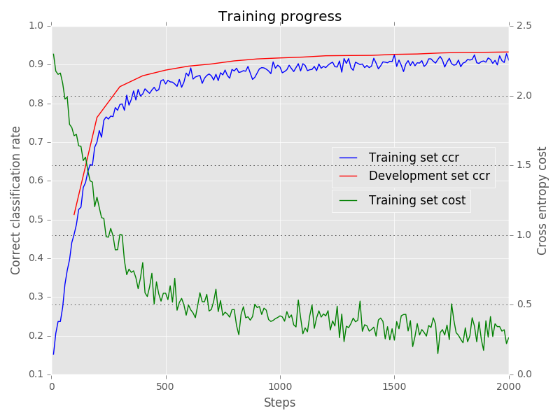

# Mandatory assignment 1

IN5400 - Machine Learning for Image Analysis Spring 2019




### Content of code

The repository contains this notebook and two folders with code: `dnn` and `cnn`:

```
.
├── cnn
│   ├── conv_layers.py
│   └── __init__.py
├── dnn
│   ├── import_data.py
│   ├── __init__.py
│   ├── main.py
│   ├── model.py
│   ├── run.py
│   └── tests.py
├── figures
│   ├── mnist_progress.png
├── README.md
└── uio_in5400_s2019_mandatory1_assignment.ipynb
```

### `dnn`

This folder contains the whole dense neural network program.

#### `main.py`

Handles program flow, data input and configurations. 


#### `import_data.py`

Handles import of the following three datasets

- MNIST
- CIFAR10
- SVHN


#### `run.py`

Contains training and evaluation routines.


#### `model.py`

Implements all the important logic of the classifier.


#### `tests.py`

In this file, predefined arrays are defined. To be used testing.

### `cnn`

In this folder, code related to the convolutional neural network implementations reside.
